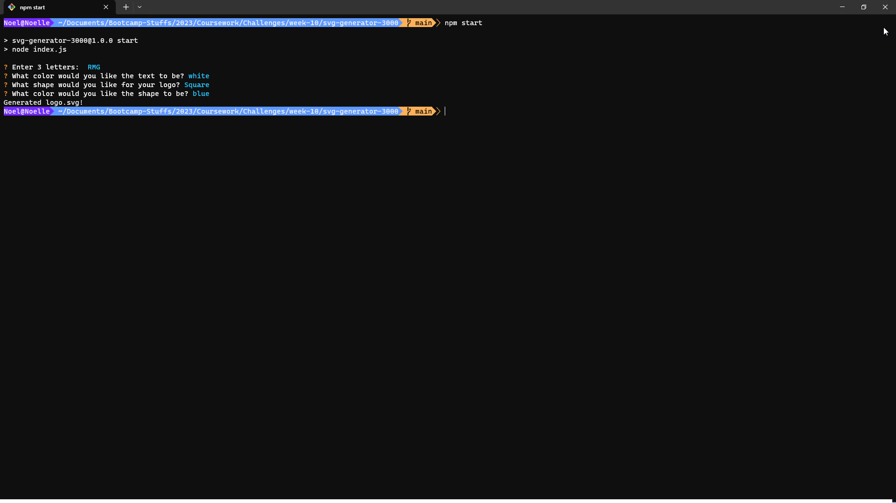

# SVG Generator

## Description
Generates an SVG from user input.
  
## Table of Contents
- [Installation](#installation)
- [Usage](#usage)
- [Tests](#tests)
- [Contributors](#contributing)
- [Questions](#questions)
- [License](#license)

## Preview

  
## Installation
1. Clone repository into any folder
2. Run command `npm i`
3. Run command `npm start` to get started
  
## Usage
- This application allows you to easily create a simple SVG logo for your websites.

## Tests
Here are some tests to run to verify a proper install:
```bash
npm run test
npm run sample
```

## Contributors
- Hunter Bell

## Questions
If you have any questions, please reach out!
- Github: [HunterBell512](https://github.com/HunterBell512)
- Email: [bellhunter512@gmail.com](mailto:bellhunter512@gmail.com)

## License
N / A
